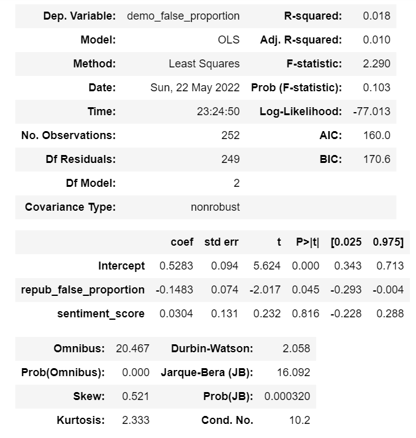

[](https://doi.org/10.5281/zenodo.6571191)

# replication-materials-hshi420
The code is written in Python 3.9.7 and all of its dependencies can be installed by running the following in the terminal (with the ``requirements.txt`` file included in this repository): 
```
pip install -r requirements.txt
```
Then you run the codes in ``final_draft_analysis.ipynb`` in code directory with ``raters.csv`` in processed_data directory.

The processed_data directory only contains the processed data that is used in initial process, and the code for preprocessing data are in ``analysis.ipynb`` located in the ``code`` directory. The raw data is too large to be uploaded to github, and I have uploaded them to Google drive.
</br></br>
link to data: https://drive.google.com/drive/folders/1KMN5FP7Oytbm5zefKjAaYp-LuMoLDdV8?usp=sharing
</br></br>
### Initial Analysis Results:
Correlation between proportion of Democrat statement rated as false and proportion of Republican statement rated as false: </br>
*Pearson correlation* = -0.13360102098360568, *p* = 0.03402135938065294
 </br>
We can see that the proportion of Democrat statement rated as false and proportion of Republican statement rated as false are negatively correlated. Our first research question that whether there is difference (I might modify the question to whether they are negatively correlated) between the proportion of Democrat statement rated as false and proportion of Republican statement rated as false is answered. With this test of our first hypothesis, we can continue to explore the mechanisms behind this negative correlation.
 </br>
 </br>
In these plots, each data point represents a factchecker. </br></br>
We can see that the two control variables do not have much effect on the dependent variable.
 </br>
 </br>
 </br>
We can see that neither of the control variables have siginifcant coefficients, and the coefficient of the left false proprotion does not changes as the control variables go into the modesl. <br><br>

This repo can be cited using DOI as tagged at the beginning of this README file.

@software{haohan_shi_2022_6571191,<br>
  author       = {Haohan Shi},<br>
  title        = {{macs30200-s22/replication-materials-hshi420: <br>
                   MACS30200\_Haohan}},<br>
  month        = may,<br>
  year         = 2022,<br>
  publisher    = {Zenodo},<br>
  version      = {v1.0.4},<br>
  doi          = {10.5281/zenodo.6571191},<br>
  url          = {https://doi.org/10.5281/zenodo.6571191}<br>
}


